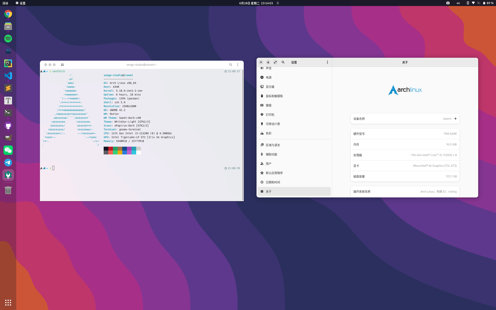

## 美化效果图

Arch Linux Gnome桌面美化效果图



## 安装gnome shell扩展

<!-- tabs:start -->

<!-- tab:从浏览器插件获取 -->

如果你想要在Google Chrome上安装Gnome Shell Integration浏览器扩展，请[点击这里](https://chrome.google.com/webstore/detail/gnome-shell-integration/gphhapmejobijbbhgpjhcjognlahblep?hl=zh-CN)

如果你想在Firefox上安装Gnome Shell Integration浏览器扩展，请[点击这里](https://addons.mozilla.org/zh-CN/firefox/addon/gnome-shell-integration/)

如果你既没有FireFox，也没有安装Google Chrome，请安装`chrome-gnome-shell`<sup>archlinuxcn</sup>，然后打开下方的网站链接来下载插件。

如果你已经安装成功了，请[点击这里](https://extensions.gnome.org/)，跳转到Gnome Shell Integration扩展页面，然后选择自己需要的扩展点击安装即可

### 推荐的gnome shell扩展

> [User Themes](https://extensions.gnome.org/extension/19/user-themes/)
> - 必须安装，不然在gnome tweak tool中shell会显示感叹号而无法更改主题
> 
> [Dash to Dock COSMIC](https://extensions.gnome.org/extension/5004/dash-to-dock-for-cosmic/)
> - 将gnome桌面配置为macOS样式
>
> [GSConnect](https://extensions.gnome.org/extension/1319/gsconnect/)
> - 类似于KDE Connect，可以连接移动设备或其他的计算机
> 
> [OpenWeather](https://extensions.gnome.org/extension/750/openweather/)
> - 查看天气情况
> 
> [Removable Drive Menu](https://extensions.gnome.org/extension/7/removable-drive-menu/)
> - 管理移动设备
> 
> [Clipboard Indicator](https://extensions.gnome.org/extension/779/clipboard-indicator/)
> - 管理剪贴板
> 
> [Dash to Panel](https://extensions.gnome.org/extension/1160/dash-to-panel/)
> - 将gnome桌面配置为Windows样式
>
> [Arc Menu](https://extensions.gnome.org/extension/3628/arcmenu/)
>-  适用于Gnome桌面的应用程序菜单，可以搭配Dash to Panel使用，类似于Budgie桌面和Gnome Classic的应用程序菜单
>
> [Arch Linux Update Indicator](https://extensions.gnome.org/extension/1010/archlinux-updates-indicator/)
> - 显示当前的Arch Linux更新情况

> **注意**:
> - 由于Arch Linux的软件更新频率较快，如果你想从浏览器安装扩展，你需要在每次Gnome桌面更新的时候都更新一下扩展，不然可能会出现异常，这一点在gnome从`3.38`更新到`40`的时候可以发现。

<!-- tab:使用aur/pacman安装 -->

运行以下命令获取gnome的shell扩展

```bash
yay gnome-shell-extension-*
```

然后安装以下几个包：`gnome-shell-extension`、`gnome-shell-extension-dash-to-panel`<sup>aur</sup>、`gnome-shell-extension-arc-menu`<sup>aur</sup>、`gnome-shell-extension-clipboard-indicator`<sup>aur</sup>、`gnome-shell-extension-openweather-git`<sup>aur</sup>、`gnome-shell-extension-removable-drive-menu`、`gnome-shell-extension-gsconnect`<sup>archlinuxcn</sup>、`gnome-shell-extension-arch-update`<sup>aur</sup>

安装完成后，在桌面中搜索“扩展”应用程序，然后在弹出的窗口中启用“内置”扩展即可。

<!-- tabs:end -->

## 安装主题

从Gnome Look网站获取主题，[点击这里](https://www.gnome-look.org/browse/)访问Gnome Look

国内下载速度慢，如果你没有任何科学上网手段，请耐心等待下在完成。

在此处可以获取光标主体、桌面主题、窗口主题和Gnome Shell主题

将主题放到`~/.local/share/gnome-shell/theme`目录下，如果你向让所有用户都可以访问你下载的主题，你可以将主题放到`/usr/share/theme`目录下。

图标主题放在`~/.local/share/icons`目录下，如果你想让所有用户都可以访问你下载的图标，你可以将图标放到`/usr/share/icons`目录下。